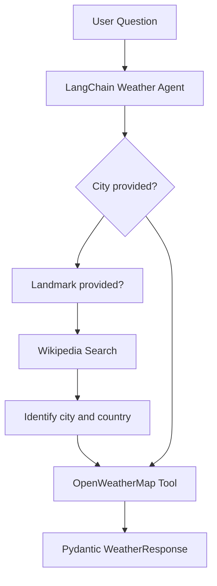

# Weather AI Agent


A tool-using AI weather assistant built with **LangChain**, **OpenAI**, **DuckDuckGo Search**, and **OpenWeatherMap**.

The agent can answer current-weather questions for cities and locations. When a user provides a landmark instead of a city, the agent first searches for the landmark's city and country, then retrieves live weather data for the identified location.

## Features

* Retrieves current weather information using OpenWeatherMap
* Identifies the city and country of a landmark using DuckDuckGo Search
* Uses a LangChain agent to select and call the required tools
* Returns validated structured output using Pydantic
* Reports:

  * Temperature
  * Weather condition
  * Humidity
  * Wind speed
* Loads API keys securely from a `.env` file

## How It Works



For example, when the user asks:

```text
What is the weather in the city where the Lotus Tower is located?
```

the agent:

1. Searches for the location of the Lotus Tower.
2. Identifies Colombo, Sri Lanka.
3. Requests current weather information for Colombo.
4. Returns the result in a structured format.

## Tech Stack

* Python
* LangChain
* LangChain OpenAI
* LangChain Community
* OpenAI
* OpenWeatherMap API
* DuckDuckGo Search
* Pydantic
* python-dotenv

## Project Structure

```text
weather-ai-agent/
│
├── main.py            # Creates and runs the weather agent
├── tools.py           # Configures search and weather tools
├── requirements.txt   # Python dependencies
├── .gitignore         # Files excluded from Git
└── README.md           # Project documentation
```

## Prerequisites

Before running the project, install or create:

* Python 3.10 or later
* An OpenAI API key
* An OpenWeatherMap API key

## Installation

### 1. Clone the repository

```bash
git clone https://github.com/Pasinduthennakoon/weather-ai-agent.git
cd weather-ai-agent
```

### 2. Create a virtual environment

#### Windows

```bash
python -m venv venv
venv\Scripts\activate
```

#### macOS/Linux

```bash
python3 -m venv venv
source venv/bin/activate
```

### 3. Install the dependencies

```bash
pip install -r requirements.txt
```

## Environment Variables

Create a `.env` file in the project root:

```env
OPENAI_API_KEY=your_openai_api_key
OPENWEATHERMAP_API_KEY=your_openweathermap_api_key
```

Do not commit the `.env` file or expose your API keys publicly.

## Usage

Run the application:

```bash
python main.py
```

The current question is defined inside `main.py`:

```python
'content': 'What is the current weather in new york?'
```

Replace it with another city or landmark question, for example:

```python
'content': 'What is the current weather in Colombo?'
```

or:

```python
'content': 'What is the weather in the city where the Lotus Tower is located?'
```

## Structured Response

The agent validates its final output with the following Pydantic model:

```python
class WeatherResponse(BaseModel):
    temperature: float
    weather_condition: str
    humidity: int
    wind_speed: float
```

A successful response follows this structure:

```text
temperature=<current temperature>
weather_condition='<current condition>'
humidity=<current humidity>
wind_speed=<current wind speed>
```

## Main Components

### Language Model

The project uses `ChatOpenAI` as the reasoning model:

```python
llm = ChatOpenAI(
    model="gpt-3.5-turbo",
    temperature=0
)
```

If this model is unavailable for your OpenAI account, replace it with an OpenAI model available to you.

### Search Tool

DuckDuckGo Search is used to identify the city and country associated with a landmark:

```python
search_tool = DuckDuckGoSearchRun()
```

### Weather Tool

The OpenWeatherMap integration retrieves current weather information:

```python
weather_api_wrapper = OpenWeatherMapAPIWrapper()

weather_tool = OpenWeatherMapQueryRun(
    api_wrapper=weather_api_wrapper
)
```

### Agent

The LangChain agent receives the language model, tools, system prompt, and structured response schema:

```python
agent = create_agent(
    model=llm,
    tools=[search_tool, weather_tool],
    system_prompt=prompt,
    response_format=WeatherResponse
)
```

## Troubleshooting

### `KeyError: 'Structured_response'`

Use the lowercase key:

```python
response["structured_response"]
```

### OpenAI Authentication Error

Confirm that the `.env` file contains a valid key:

```env
OPENAI_API_KEY=your_openai_api_key
```

### OpenWeatherMap Authentication Error

Confirm that the `.env` file contains:

```env
OPENWEATHERMAP_API_KEY=your_openweathermap_api_key
```

New OpenWeatherMap API keys may require some time before they become active.

### Missing Module Error

Reinstall the project dependencies:

```bash
pip install -r requirements.txt
```

### Model Access or Model-Not-Found Error

Update the model name in `main.py` to one supported by your OpenAI account.

## Possible Improvements

* Accept the weather question through terminal input
* Add conversational memory
* Add hourly and multi-day forecasts
* Create a Streamlit or Flask user interface
* Add unit selection for Celsius and Fahrenheit
* Add error handling and input validation
* Add automated tests
* Deploy the agent as a REST API

## Contributing

Contributions are welcome.

1. Fork the repository.
2. Create a feature branch.
3. Commit your changes.
4. Push the branch.
5. Open a pull request.

## Author

**Pasindu Piyumantha Thennakoon**

* GitHub: [Pasinduthennakoon](https://github.com/Pasinduthennakoon)
* Repository: [weather-ai-agent](https://github.com/Pasinduthennakoon/weather-ai-agent)
  ::: 
